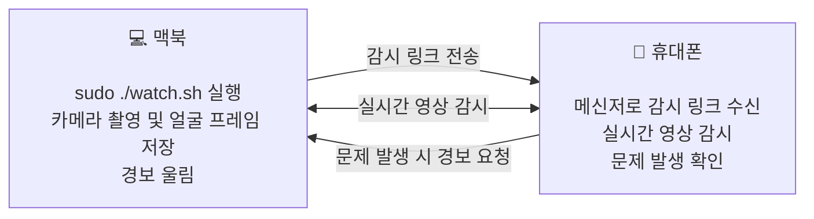

# Macbook Theft Alarm

카페처럼 공공장소에서 잠시 자리를 비울 때 맥북을 두고 가는 불안을 줄이기 위한 개인용 감시 도구입니다. 실행하면 내장 카메라 영상을 임시 링크로 중계하고, 해당 링크를 휴대폰 메신저로 보냅니다. 휴대폰에서 현장 영상을 계속 확인하다가 도난 정황을 빠르게 인지하고 대응할 수 있으며, 필요하면 원격으로 본체 경보를 켜거나 끌 수 있습니다. 경보를 쫓아가서 도둑을 잡으면 됩니다.

이 도구는 불안감을 줄이고 사후 대응을 돕기 위한 보조 수단일 뿐입니다. 도난을 막는 확실한 방법은 아니므로, 걱정된다면 이 스크립트를 실행하기보다 맥북을 직접 챙기는 편이 낫습니다.

- 카메라 프레임을 로컬 폴더에 계속 저장합니다.
- 감시 링크는 기본적으로 10분 뒤 종료됩니다.
- 휴대폰 페이지에서만 경보를 제어합니다. 자동 흔들림/뚜껑 감지는 사용하지 않습니다.
- 맥북을 열거나 닫는 것과 관계없이 경보는 계속 울립니다.

## 동작 흐름



## 요구 사항

- macOS 14 이상
- 외부 접속과 알림 발송을 위한 인터넷 연결이 필요합니다.
- 사용 가능한 스피커 또는 오디오 출력 장치가 필요합니다.

처음 실행할 때 `watch.sh`가 필요한 도구를 점검합니다. Swift가 없으면 macOS의 Xcode Command Line Tools 설치 창을 열고, ngrok가 없으면 자동 설치합니다. ngrok 계정 로그인 토큰과 감시 링크를 받을 메신저 웹훅 주소는 직접 입력해야 합니다. 카메라 권한은 macOS 승인 창에서 허용해야 하며, 거부했다면 시스템 설정의 카메라 페이지를 자동으로 엽니다.

## 설치 및 첫 실행

1. 저장소를 복제하고 프로젝트 폴더로 이동합니다.

```zsh
git clone <repository-url> macbook-theft-alarm
cd macbook-theft-alarm
```

2. 프로젝트 폴더에서 감시 모드를 시작합니다.

```zsh
sudo ./watch.sh
```

처음 실행하는 경우 스크립트가 아래 항목을 자동으로 처리하거나 필요한 입력을 안내합니다.

- Xcode Command Line Tools가 없으면 macOS 설치 창을 열며, 설치가 끝난 뒤 같은 명령을 한 번 더 실행해야 합니다.
- ngrok가 없으면 자동 설치하고, ngrok 대시보드에서 발급한 `authtoken`을 붙여 넣으라고 요청합니다.
- 녹화 폴더는 `~/Movies/MacBook Theft Alarm`로 자동 생성합니다.
- 감시 링크를 받을 Slack, Telegram, Discord 또는 일반 웹훅 URL을 입력하라고 요청합니다. Telegram URL이면 이어서 수신 `chat_id`도 입력해야 합니다.
- 카메라 권한은 macOS 승인 창에서 허용해야 합니다. 거부한 경우 카메라 설정 화면이 열립니다.

입력을 마치면 `config.json`이 자동 생성되고 앱을 빌드해 감시를 시작합니다. 실행되면 검은 화면의 `CCTV 감시중` 창이 보이고, 설정한 메신저로 감시 링크가 전송됩니다. 휴대폰에서 해당 링크를 열면 영상과 `경보 울림`/`경보 끄기` 토글을 사용할 수 있습니다.

시작 전에 인터넷 연결과 오디오 출력 장치를 확인합니다. 연결이 없으면 `인터넷 연결이 필요합니다.` 오류를 표시하고 시작하지 않습니다.

터미널에는 설정, 인터넷, 오디오 출력, 카메라 첫 프레임, 로컬 녹화, 내부 서버, ngrok 링크, 웹훅 HTTP 응답 순서로 준비 상태가 출력됩니다. 대기 시간이 있는 단계는 회전 표시로 진행 중임을 보여 줍니다. 웹훅 전송이 성공할 때까지 `CCTV 감시중` 전체 화면은 표시되지 않으며, 성공 후에는 실행 터미널 창을 최소화합니다.

`swift run alert watch`로도 실행할 수 있지만, 뚜껑을 닫은 뒤에도 경보음을 유지하려면 `sudo ./watch.sh`를 사용해야 합니다.

기본 종료 키는 `Esc` 또는 `Enter`입니다. `Ctrl-C`로도 종료할 수 있습니다. `watch.sh`는 종료 시 일반적인 잠자기 설정을 자동으로 복구합니다. 비정상 종료 후 뚜껑을 닫아도 잠들지 않으면 아래 명령을 실행합니다.

```zsh
sudo pmset -a disablesleep 0
```

## 설정

`config.json`에는 실제 웹훅 주소와 로컬 저장 경로가 들어 있으므로 커밋하면 안 됩니다. 기본 `.gitignore`가 이를 제외하며, [config.example.json](config.example.json)만 저장소에 포함합니다. 예시 파일에는 실제 토큰, 웹훅 주소, 사용자명, 클라우드 경로를 넣으면 안 됩니다.

경보음은 카메라나 외부 연결 없이 다음 명령으로 각각 10초씩 확인할 수 있습니다. 테스트는 현재 macOS 볼륨으로 재생하며, `alarm_volume`은 적용하지 않습니다.

```zsh
swift run alert sound-test 1
swift run alert sound-test 2
swift run alert sound-test 3
swift run alert sound-test 4
swift run alert sound-test 5
```

| 키 | 설명 | 값과 예시 |
| --- | --- | --- |
| `alarm_volume` | 경보 재생 볼륨입니다. 실행 시 macOS 출력 볼륨도 이 값으로 올리고, 감시 모드가 끝나면 원래 볼륨으로 복구합니다. | 정수 `0`~`100`. 예: `100` |
| `alarm_playback_gain` | 생성한 경보음에 적용할 디지털 재생 증폭입니다. 값이 높을수록 소리가 커지지만 왜곡될 수 있습니다. | 0보다 크고 10 이하. 기본값: `8` |
| `alarm_sound_type` | 경보음 패턴입니다. 짧은 경보음 클립을 경보 해제 또는 감시 종료 때까지 반복 재생합니다. | `1`(현재 기본 사이렌), `2`(빠른 3연속 위험 경고음), `3`(높고 낮은 음의 반복 경고음), `4`(중저음 3연속 기계 펄스), `5`(중저음 교대 산업용 혼). 예: `4` |
| `alarm_siren_low_hz` | 경보음의 낮은 음 높이입니다. 낮출수록 더 묵직하게 들립니다. | 0보다 큰 숫자이며 `alarm_siren_high_hz`보다 작아야 합니다. 예: `760` |
| `alarm_siren_high_hz` | 경보음의 높은 음 높이입니다. 높일수록 더 날카롭게 들립니다. | 낮은 음보다 큰 숫자. 예: `1320` |
| `alarm_siren_sweep_hz` | 높은 음과 낮은 음이 오가는 속도입니다. | 0보다 큰 숫자. 예: `2.6`은 초당 약 2.6회 전환 |
| `alarm_siren_pulse_hz` | 경보음의 잘게 끊기는 펄스 속도입니다. | 0보다 큰 숫자. 예: `7` |
| `warning_text` | 맥북 전체 화면 중앙에 표시할 빨간 문구입니다. | 비어 있지 않은 문자열. 예: `"CCTV 감시중"` |
| `warning_window_level` | 경고 창이 다른 창 위에 뜨는 수준입니다. | `normal`, `floating`, `screenSaver`. 기본값: `screenSaver` |
| `warning_window_opacity` | 전체 경고 창의 투명도입니다. 문구도 같은 투명도로 표시됩니다. | 0보다 크고 1 이하의 숫자. 기본값: `0.1` |
| `kill_switch_keys` | 감시 모드를 끝내는 전역 키 목록입니다. | 배열. `c`, `enter`, `escape`, `space`, `q`를 사용할 수 있습니다. 기본값: `["escape", "enter"]` |
| `prevent_sleep` | 감시 중 일반적인 macOS 잠자기를 막습니다. | `true` 또는 `false`. 기본값: `true` |
| `live_port` | 맥북 내부 영상 중계 서버 포트입니다. ngrok가 이 포트를 외부에 연결합니다. | `1024`~`65535` 정수. 기본값: `8787` |
| `live_max_seconds` | 감시가 자동 종료될 때까지의 시간(초)입니다. | 0보다 큰 숫자. 예: `600`은 10분 |
| `live_snapshot_fps` | 휴대폰 페이지로 전달할 초당 카메라 프레임 수입니다. 높을수록 부드럽지만 네트워크 사용량이 늘어납니다. | 0보다 큰 숫자. 기본값: `12` |
| `local_record_fps` | 로컬 저장 폴더에 기록할 초당 JPEG 프레임 수입니다. | 0보다 큰 숫자. 예: `5` |
| `recording_dir` | 프레임을 저장할 기존 폴더입니다. 폴더가 없거나 쓰기 불가하면 실행을 시작하지 않습니다. | 절대 경로. 예: `"/Users/me/Library/CloudStorage/.../맥북 Theft Alarm"` |
| `notification_webhook_url` | 감시 링크를 받을 메신저 또는 웹훅 주소입니다. 주소 패턴에 따라 전송 형식을 자동 선택합니다. | Slack, Telegram, Discord 또는 일반 웹훅 URL. 실제 비밀 주소는 커밋 금지 |
| `notification_recipient` | Telegram 수신 대상을 지정하는 `chat_id`입니다. | Telegram에서만 필요합니다. Slack, Discord, 일반 웹훅은 `""` |

## 알림 대상

`notification_webhook_url` 주소를 보고 전송 형식을 자동 선택합니다.

| 주소 패턴 | 전송 방식 |
| --- | --- |
| `hooks.slack.com/services/...` | Slack Block Kit 메시지와 감시 링크를 전송합니다. |
| `api.telegram.org/bot...` | Telegram Bot API `sendMessage`를 사용합니다. `notification_recipient`에 `chat_id`가 필요합니다. |
| `discord.com/api/webhooks/...` 또는 `discordapp.com/api/webhooks/...` | Discord 웹훅의 `content` 메시지를 전송합니다. |
| 그 외 | JSON `POST`를 전송합니다: `text`, `url`, `expires_in_seconds` |

Telegram URL은 `https://api.telegram.org/bot<BOT_TOKEN>/sendMessage` 형식이어야 합니다. 일반 웹훅은 위 JSON 본문을 받도록 구성해야 합니다.

## 로컬 녹화

실행할 때마다 `recording_dir` 아래에 시간 기반 폴더가 만들어지고, `frame-000000.jpg` 형식의 카메라 프레임이 저장됩니다. Google Drive 데스크톱 폴더를 지정하면 네트워크가 돌아온 뒤 Drive가 동기화합니다. 이 프로그램은 동영상 파일을 직접 업로드하지 않습니다.

## 문제 해결

- `저장 폴더를 찾을 수 없습니다`: `recording_dir`을 Finder에서 실제로 존재하는 클라우드 동기화 폴더로 바꿔야 합니다.
- `카메라 프레임이 ... 들어오지 않았습니다`: 카메라 권한, 다른 카메라 사용 앱, Continuity Camera 연결 상태를 확인해야 합니다.
- 감시 링크가 오지 않음: `ngrok` 로그인 상태와 `notification_webhook_url`을 확인해야 합니다.
- 뚜껑을 닫은 뒤에도 잠들지 않음: `sudo pmset -a disablesleep 0`을 실행해야 합니다.
